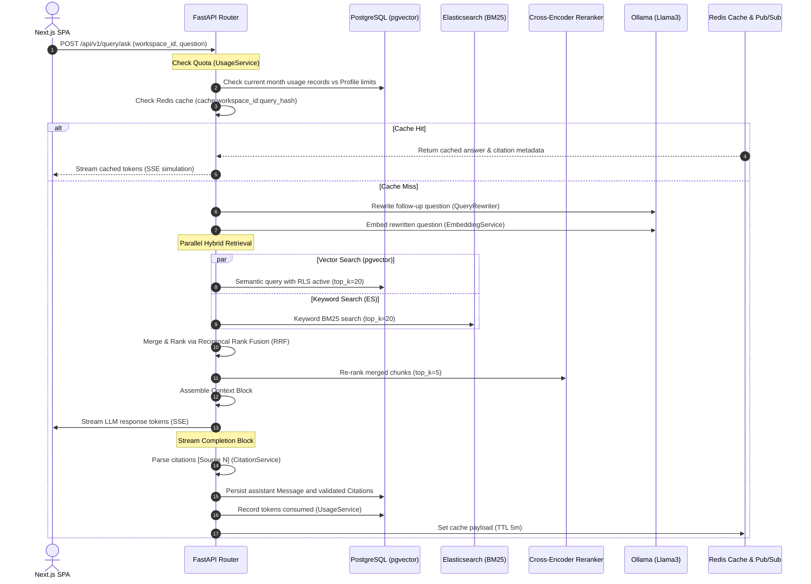

# CortexRAG — Secure, Local-First AI Document Intelligence Platform

CortexRAG is an enterprise-grade, local-first Retrieval-Augmented Generation (RAG) platform designed to ingest, process, and query private documents with strict security, high performance, and robust multi-tenant isolation.

---

## 1. Technology Stack & Implementation

The platform is designed to be self-hosted, modular, and optimized for local execution without external data leaks.

### 1.1 Core Architecture Components
*   **Frontend User Interface:**
    *   **Framework:** Next.js 14 (App Router) & React 19.
    *   **Language:** TypeScript (strict type checking enabled).
    *   **Styling:** TailwindCSS with modern glassmorphic design and responsive layout templates.
    *   **Auth Management:** Axios HTTP clients using state-bound in-memory JWT tokens (never exposed to `localStorage` or `sessionStorage` to mitigate XSS risks) combined with HttpOnly cookies for rotation.
*   **Backend Application:**
    *   **Framework:** FastAPI (Python 3.11, async/await native ASGI).
    *   **Database ORM:** SQLAlchemy 2.0 (async/await model engines).
    *   **Database Migrations:** Alembic schema versioning.
    *   **Logging & Auditing:** `structlog` for structured, correlation-tagged JSON output logs.
*   **Databases & Vector Storage:**
    *   **Relational Database:** PostgreSQL 16 with Row-Level Security (RLS) policies enabled.
    *   **Vector Search Database:** `pgvector` extension utilizing HNSW indexes for sub-millisecond cosine similarity searches.
    *   **Full-Text Search Engine:** Elasticsearch 8 driving BM25 keyword matching.
    *   **Key-Value Cache & Message Broker:** Redis 7 (caching RAG answers, token tracking, and driving Celery worker queues).
*   **Document Storage:**
    *   **Object Storage:** MinIO (private S3-compatible buckets for secure, isolated document storage).
*   **Local Inference & LLM Engine:**
    *   **LLM Provider:** Ollama (serving local weights of `llama3` for response generation and query rewriting, and `nomic-embed-text` for vector generation).
    *   **Reranker:** MS-MARCO Cross-Encoder model running natively via PyTorch.
*   **Task Ingestion Worker:**
    *   **Framework:** Celery (processes heavy CPU parsing, chunking, and index insertions asynchronously).
*   **Reverse Proxy & SSL Gateway:**
    *   **Server:** Caddy (handles automated SSL termination, path routing, and secure API/WebSocket request forwarding).

---

## 2. System Architecture & Request Lifecycles

### 2.1 System Architecture Layers

The block diagram below details how the client, gateway proxy, internal application, and backing storage clusters are partitioned:

```
┌──────────────────────────────────────────────────────────────┐
│  CLIENT LAYER                                                 │
│  Next.js (React) SPA — streaming chat UI, document manager   │
│  (Tailwind CSS, TypeScript, Axios in-memory JWT storage)     │
└────────────────────────────┬─────────────────────────────────┘
                             │ HTTPS / WSS
┌────────────────────────────▼─────────────────────────────────┐
│  GATEWAY LAYER                                                │
│  Caddy reverse proxy — SSL termination, path-based routing   │
└────────────────────────────┬─────────────────────────────────┘
                             │
┌────────────────────────────▼─────────────────────────────────┐
│  APPLICATION LAYER — FastAPI (Python 3.11, async)            │
│  - Middleware: Correlation ID, CORS, RLS context setter      │
│  - Security: Bleach HTML stripping, brute force rate-limits  │
└───────────┬─────────────────────────┬────────────────────────┘
             │ DB sessions             │ enqueue tasks
┌───────────▼──────────┐   ┌──────────▼──────────────────────┐
│  DATA LAYER           │   │  QUEUE LAYER                     │
│                       │   │  Celery workers + Redis broker   │
│  PostgreSQL + pgvector│   │  (isolated network for security)  │
│  (RLS enabled)        │   │                                  │
│                       │   │  Tasks:                          │
│  Redis                │   │    ingestion, embedding,         │
│  (cache + pub/sub)    │   │    notifications, cleanup        │
│                       │   └──────────────────────────────────┘
│  MinIO                │
│  (private S3 buckets) │
│                       │
│  Elasticsearch        │
│  (BM25 keyword search)│
└───────────────────────┘
```

### 2.2 RAG Query Request Lifecycle

The sequence diagram below shows the runtime processing path of a RAG query:



---

## 3. Local Installation & Setup

Follow these instructions to configure and run the entire platform locally on your machine.

### 3.1 Prerequisites
*   Docker & Docker Compose (v2.20.0+)
*   WSL2 (if running on Windows)

### 3.2 Setup & Startup Steps
1.  **Configure Environment:**
    Copy the example configuration file and fill in required fields:
    ```bash
    cp .env.example .env
    ```
2.  **Ensure a Clean Start (Wipe Stale Volumes):**
    If you are upgrading from previous builds or databases, clean up all cached layers and volumes to prevent schema conflicts:
    ```bash
    docker compose down -v
    ```
3.  **Build & Run Services:**
    Launch all database, inference, cache, application, and frontend services:
    ```bash
    docker compose up --build
    ```
4.  **Run Database Migrations:**
    Once PostgreSQL is up and healthy, initialize tables, constraints, and Row-Level Security policies:
    ```bash
    docker compose exec backend alembic upgrade head
    ```
5.  **Access the Platform:**
    Open your browser and navigate to the unified Caddy gateway origin:
    *   **Frontend Webapp:** `http://localhost:8080`
    *   **API Interactive Documentation:** `http://localhost:8080/docs`

---

## 4. Development Challenges & Engineering Solutions

During the construction and optimization phases, several technical challenges were addressed:

### 4.1 ASGI WebSocket Support & Middleware Conflicts
*   **The Problem:** Standard Starlette `BaseHTTPMiddleware` captures HTTP cycles but breaks ASGI connection upgrades required for WebSockets. This caused all frontend WebSocket connection attempts to close instantly.
*   **The Solution:** Middlewares (such as RLS Context, Correlation ID, and Security Headers) were rewritten into raw ASGI middleware classes that inspect the connection `scope` and pass WebSocket requests through without disrupting the protocol upgrade.

### 4.2 Local CPU Inference Saturation
*   **The Problem:** Generating chunk embeddings for large documents in the background worker saturated CPU threads. If a user asked a query concurrently, their request queued in Ollama and timed out.
*   **The Solution:** 
    1.  Ollama client timeouts inside `EmbeddingService`, `LLMService`, `QueryRewriter`, and `SummaryService` were extended to `300.0` seconds (5 minutes) to handle cold starts.
    2.  Local MS-MARCO reranking is configured to gracefully fallback to RRF weights directly when GPU acceleration is not available, preventing thread pools from hanging.

### 4.3 Async ORM "MissingGreenlet" Validation Exceptions
*   **The Problem:** In the chat page, Pydantic's serialization of the `QuerySessionResponse` model triggered lazy-loading on nested relationships (`Message.citations`, `Citation.chunk`, etc.). Since implicit sync I/O is prohibited in async mode, SQLAlchemy raised a `MissingGreenlet` exception.
*   **The Solution:** Updated the session queries in the backend `/sessions` routes of [query.py](file:///d:/Projects/PORTFOLIO/CORTEXRAG/backend/app/api/v1/query.py) to use chained, nested `selectinload` options. This eager-loads the entire hierarchy in a single asynchronous query.

### 4.4 Multi-Tenant Row-Level Security Enforce
*   **The Problem:** The default postgres database user created by Docker Compose is a superuser, which automatically bypasses Postgres RLS policies.
*   **The Solution:** Implemented explicit filter guards (`.where(Table.workspace_id == workspace_id)`) across every repository and router query, ensuring tenant isolation is validated programmatically at the query building stage as a secondary safety boundary.
