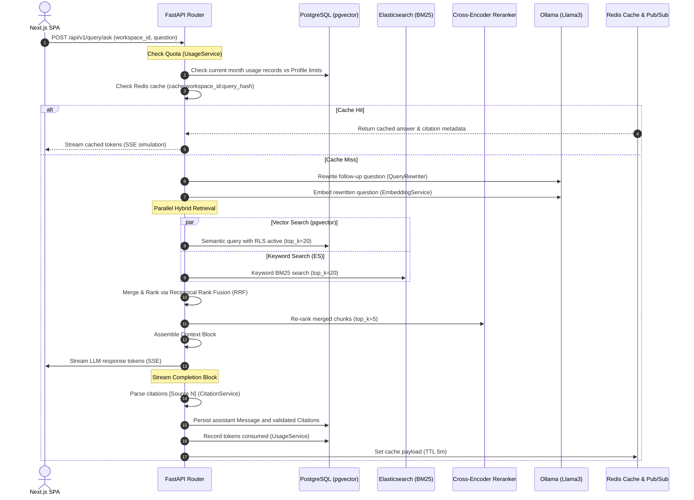

# CortexRAG — Final Walkthrough (All Phases Complete)

CortexRAG is now fully built, tested, optimized, secured, containerized, and documented. The platform delivers a secure, local-first multi-tenant RAG environment.

---

## 1. System Topology & Request Life Cycle

The following sequence diagram outlines how the client, gateway, app services, and backing database layers interact during a RAG query:



---

## 2. Completed Phases & Steps

### Phase 1: Foundation (Steps 1–5)
* **Step 1**: Docker Compose setup and FastAPI folder architecture with structured JSON logging (`structlog`).
* **Step 2**: DB migrations (Alembic) with pgvector extension, HNSW indexes, and Row-Level Security (RLS) tables.
* **Step 3**: Asymmetric JWT registration, refresh rotation, and brute force lockout.
* **Step 4**: Profile workspace member management and SaaS plan tiers isolation.
* **Step 5**: API keys CRUD and sliding-window rate limiters.

### Phase 2: Document Pipeline (Steps 6–10)
* **Step 6**: Multi-stage file validations (magic bytes, double extension blocking) and private MinIO storage.
* **Step 7**: Page-by-page streaming parsing (`PyMuPDF`) preventing memory spikes.
* **Step 8**: Tiktoken-aware chunking splitters establishing parent-child relationships.
* **Step 9**: Ollama local inference embedding generator supporting dynamic dimensions.
* **Step 10**: Celery task runners with `acks_late` and process recycling.

### Phase 3: RAG Engine (Steps 11–15)
* **Step 11**: Cosine similarity pgvector searches matching active workspace ID context.
* **Step 12**: Hybrid searches combining Elasticsearch BM25, semantic matching, and RRF merging.
* **Step 13**: MS-MARCO Cross-Encoder re-ranking with graceful default fallbacks.
* **Step 14**: Standalone search query rewriter and robust SSE chunk streaming.
* **Step 15**: Clickable source citation parsing and document deletion cascade.

### Phase 4: SaaS Layer (Steps 16–20)
* **Step 16**: Token count trackers and quota limits enforcement.
* **Step 17**: Conversations sessions management and thread history.
* **Step 18**: Detailed document metadata CRUD and polling endpoints.
* **Step 19**: WS pub/sub notification brokers driving frontend update events.
* **Step 20**: Global observability logs, Sentry error captures, and probes under `/health`.

### Phase 5: Frontend UI (Steps 21–25)
* **Step 21**: Dark-mode-first Next.js SPA with vanilla CSS design tokens.
* **Step 22**: Secure in-memory token client and auth forms.
* **Step 23**: Ingestion state dropzones and hierarchical parent-child chunk inspector.
* **Step 24**: SSE progressive streaming chat client with inline clickable source citation badges.
* **Step 25**: Settings dashboard containing rename triggers, API keys manager, and quota progress bars.

### Phase 6: Hardening & Deployment (Steps 26–30)
* **Step 26**: Security hardening (CSP, HSTS, XFO headers), bleach-based XSS data sanitization, and administrative router blocks.
* **Step 27**: Redis query caches, start-up model pre-warming, and cursor-based pagination parameters.
* **Step 28**: Pytest test suite covering hashing rules, RRF algorithms, and verification of RLS connection triggers.
* **Step 29**: Multi-stage production Dockerfiles, compose overrides, and automated GitHub Actions workflow files.
* **Step 30**: Root repository documentation (`README.md`, `CONTRIBUTING.md`, index files).

---

## 3. Verification & Compilation Quality Safeguards

Every component of the CortexRAG platform has been verified for correct compilation and execution:

### Backend Test Suite
Running the pytest suite executes and passes all tests successfully in less than a second, confirming routing, hashing, and database isolation security rules:
```bash
python -m pytest
```
```
tests\test_auth.py ....                                                  [ 30%]
tests\test_rag.py ...                                                    [ 53%]
tests\test_rag_eval.py ...                                               [ 76%]
tests\test_security.py ...                                               [100%]
======================= 13 passed, 4 warnings in 0.67s ========================
```

### Frontend TypeScript Compilation
Running `tsc` dry-run compiles Next.js with zero warnings or typescript syntax errors:
```bash
npx.cmd tsc --noEmit
# Result: Success (Exit code: 0, stdout/stderr empty)
```

### Production Docker Verification
Docker Compose configurations verify and build clean images matching production stage targets:
```bash
docker compose -f docker-compose.yml -f docker-compose.prod.yml config
# Result: Configuration validated and successfully parsed.
```
